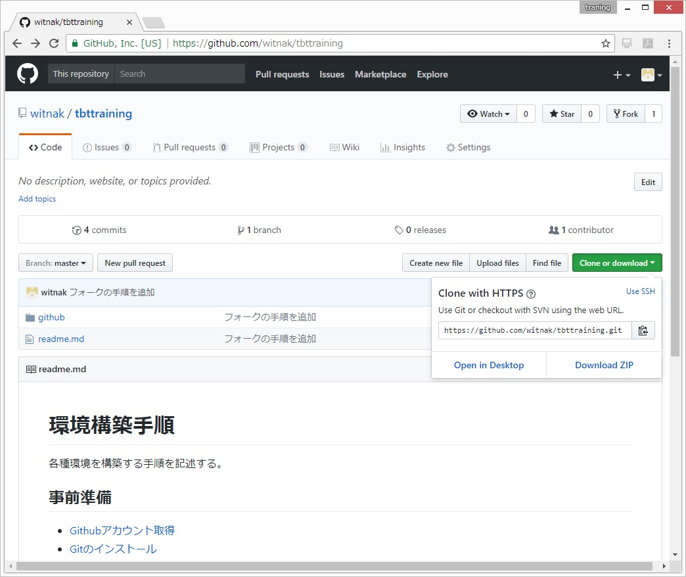

# ローカルPCへクローンする

前提として、リポジトリのフォークとGitのインストールは完了していること。  

0. フォルダを作成してそこに移動。  
どこに作成するかは、任意。  
以下は、　`c:\ws\practice\`　にクローンする想定。  
```
 cd c:
 mkdir ws
 cd ws
 mkdir practice
 cd practice
```
0. クローン用URLを取得する。  
  
0. クローンする。
```
git clone https://github.com/witnak/tbttraining.git
```
0. 以下は実行ログ  
```
C:\ws\practice>git clone https://github.com/witnak/tbttraining.git
Cloning into 'tbttraining'...
remote: Counting objects: 28, done.
remote: Compressing objects: 100% (23/23), done.
remote: Total 28 (delta 5), reused 28 (delta 5), pack-reused 0
Unpacking objects: 100% (28/28), done.

C:\ws\practice>
C:\ws\practice>
C:\ws\practice>dir
 ドライブ C のボリューム ラベルは Windows です
 ボリューム シリアル番号は CE4E-8211 です

 C:\ws\practice のディレクトリ

2017/10/18  13:24    <DIR>          .
2017/10/18  13:24    <DIR>          ..
2017/10/18  13:25    <DIR>          tbttraining
               0 個のファイル                   0 バイト
               3 個のディレクトリ  282,090,782,720 バイトの空き領域

C:\ws\practice>
```
