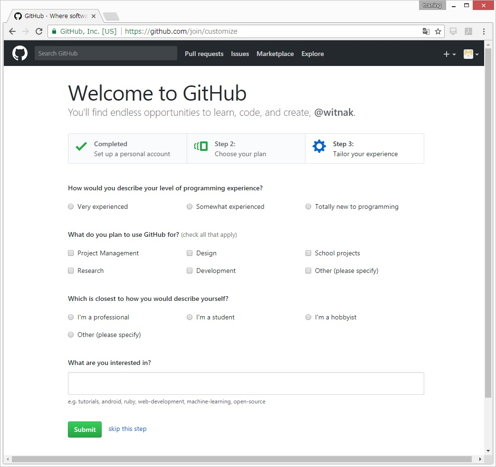
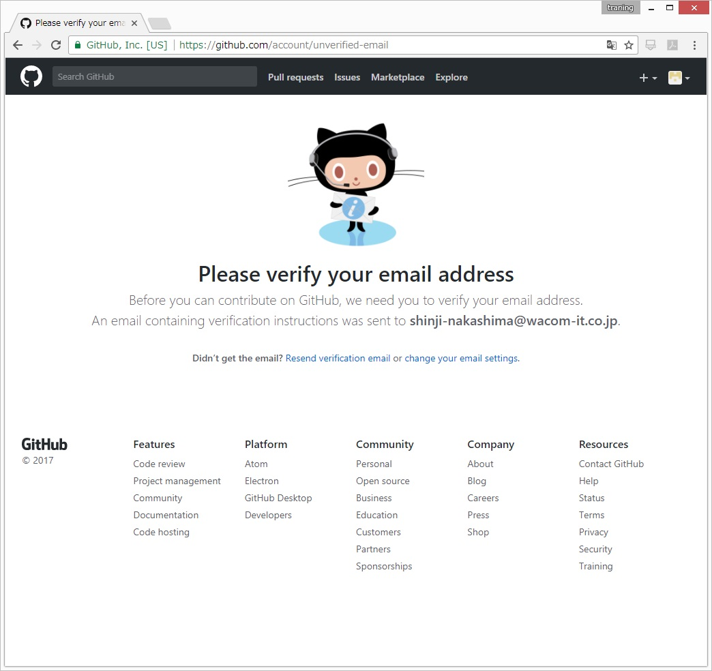
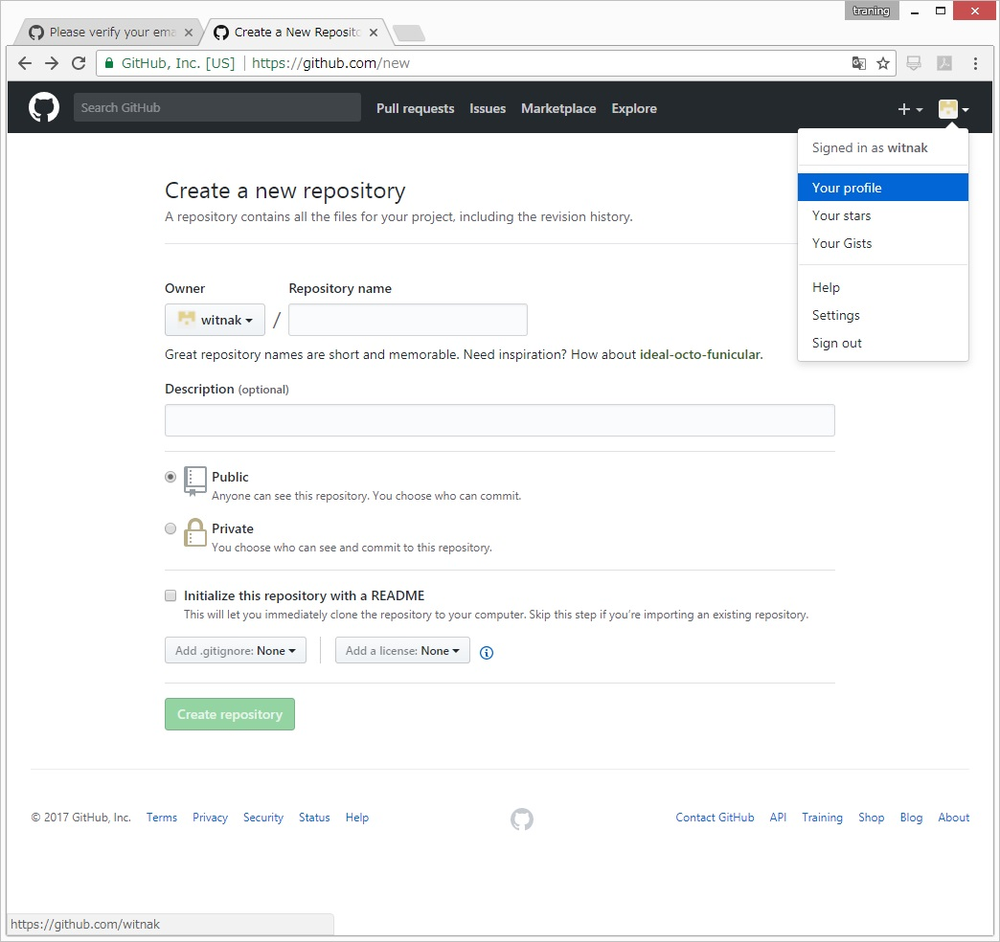

# Githubのアカウント取得手順。

0. Githubへアクセスする。 https://github.com/  
  
0. 必要事項を入力してサインアップ  
  
0. 登録完了。アンケートを入力しないなら「skip this step」をクリック　　
（この時点でメールが送信される）  
  
0. ガイドの表示はスキップ  

0. これが出たら、メールのVerifyリンクをクリックする。  
  
0. リポジトリ作成は後でするので、プロファイルページへ移動する。  
  
