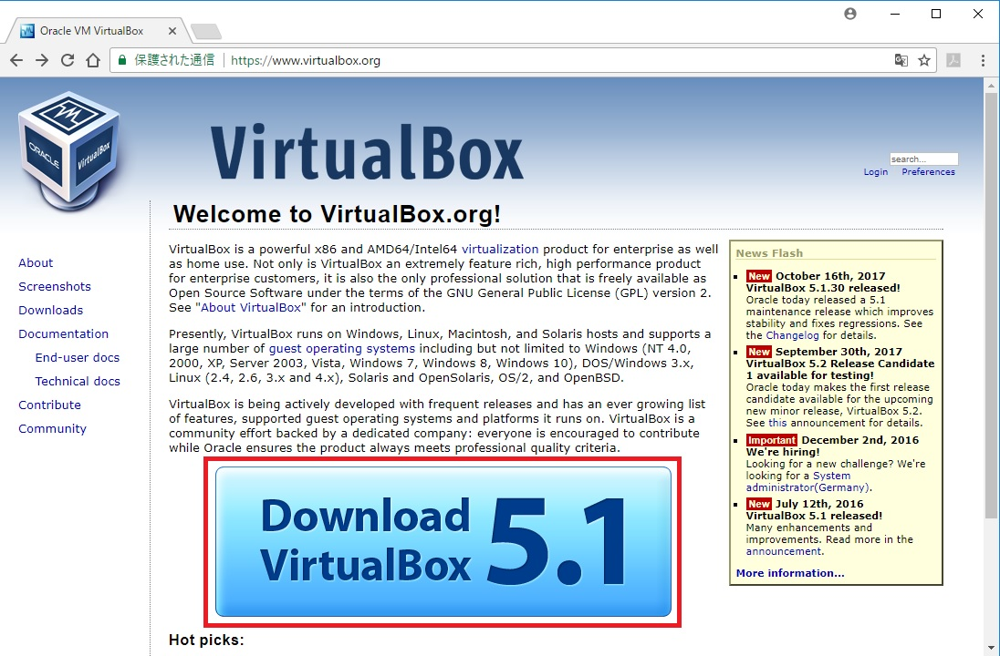
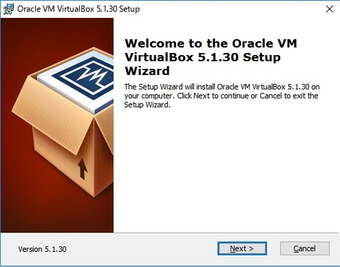
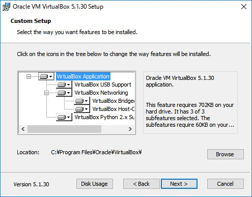
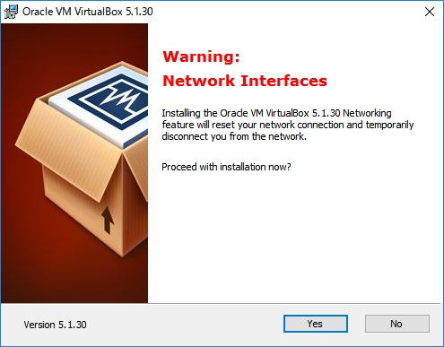
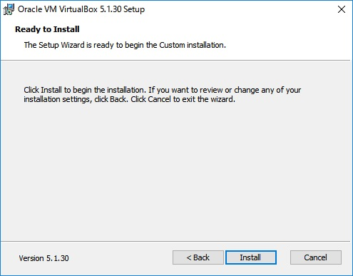
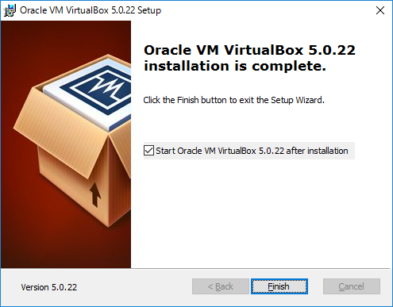

# VirtualBoxをインストールする

1. VirtualBoxダウンロードサイトへアクセスする。https://www.virtualbox.org/
　　
2．VirtualBox 5.1.30 platform packagesにある該当OSをクリック。（インストーラがダウンロードされる）　　
今回はWindowsを選択する。
　　
3．ダウンロードされたインストーラを実行する。　　

4．次のように表示されるので、「next」を選択する。
　　
5．VirtualBoxをインストールする場所の指定ができる。
今回は特に変更する必要がないので「next」を選択。
　　
6．インストール後のショートカットやアイコンの設定。
こちらも同じく変更する必要がないので「next」を選択。
　　
7．一時的にネットワークが切断されているという警告がでるがそのままYesを選択。　　
　　
8．インストールの最終確認画面が表示されるので「install」を選択。
　　
9．インストール完了後「Finish」をクリックするとインストールされたVirtualBoxが起動する。

