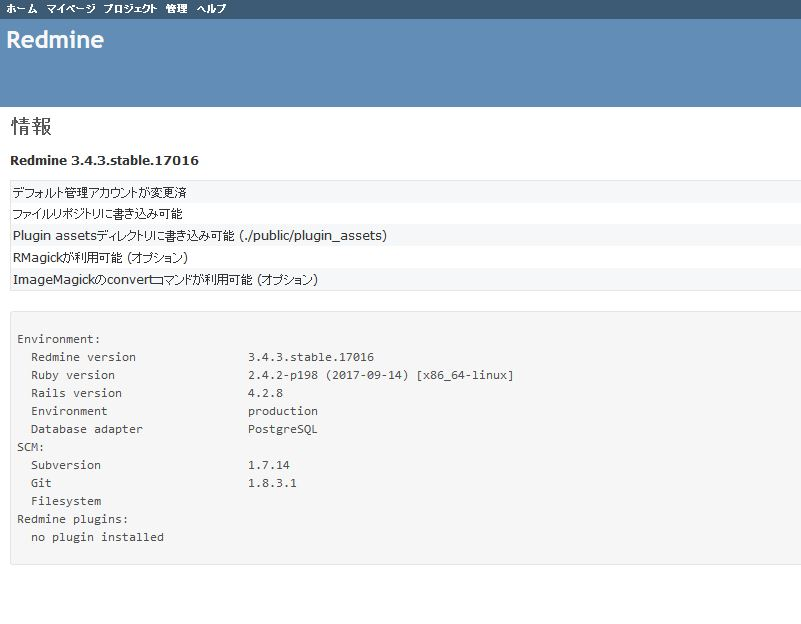

# RedmineのデータベースをPostgreSQLからMariaDBへ切り替える

  Redmineのインストール手順でDBをPostgreSQLに設定していました。  
  今回はこのRedmineのDBを前手順でインストールしたMariaDBに切り替えます。

  1. まずは現在のDBの設定を確認します。  
  RedmineにWebブラウザからアクセスし、`管理者でログイン→管理→情報`と進みます。  
  現在はこのような設定になっていると思います。
<div align=center>
  
</div>
  *Database adapterがPostgreSQLになっています*

  2. PostgreSQLが設定されていることがわかったら、MariaDBに切り替える作業をします。  
     MariaDBにRedmine用のデータべースとユーザを作成します。

```

  $ mysql -u root -p

  # データベースの作成
  $ MariaDB [(none)]> create database db_redmine default character set utf8;

  # ユーザの作成
  $ MariaDB [(none)]> grant all on db_redmine.* to user_redmine@localhost identified by '[任意のパスワード]';

  # 権限の反映
  $ MariaDB [(none)]> flush privileges;

  # ログアウト
  $ MariaDB [(none)]> exit;

```

  3. 続いてデータベースの設定ファイルをRedmineでMariaDBが利用できるように編集します。

```

  # 設定ファイルの編集
  $ vi config/database.yml
    production:
      adapter: mysql2           # postgresqlから変更
      database: db_redmine      # データベース名
      host: localhost
      username: user_redmine
      password: "[前手順で決めたパスワードを入力]"
      encoding: utf8

```

  2. 続いて「yaml_db」というgemパッケージをインストールします。  
  「yaml_db」とは、切り替え元のデータを書き出し、切り替え先のデータベースに取り込むことを目的としたgemパッケージです。

```

  # Redmineのインストールディレクトリに移動
  $ cd /var/lib/redmine

  $ vi Gemfile
    source 'https://rubygems.org'
                ・

                ・
                ・
    gem "roadie", "~> 3.2.1"
    gem "mimemagic"
    #ここから追記
    gem "yaml_db"
    #ここまで

  # 保存後インストール
  $ bundle install --without development test --path vendor/bundle

```

  3. 切り替え元の初期データを書き出します。  
     以下のコマンドを実行してください。

```

  #データの書き出し
  $ bundle exec rake db:dump RAILS_ENV=production

```
  このコマンドを実行することで、データを書き出し、「data.yml」というファイルを生成します。


  6. 設定ファイルを編集したら、先ほど書き込んでおいたデータを読み込みます。
     読み込みが終了したら、サーバを再起動します。

```
  # データの読み込み
  $ bundle exec rake db:load RAILS_ENV=production

  # サーバの再起動
  $ service httpd restart

```

  7. 再起動後Redmineにアクセスし、手順1と同じように、管理者でログイン→管理→情報と進みます。  
<div align=center>
  
</div>
  *Database adapterがMysql2になっています*

  ※MariaDBはMySQLの派生DBMSのため、各種設定ファイルにはMySQL2を記述します。  