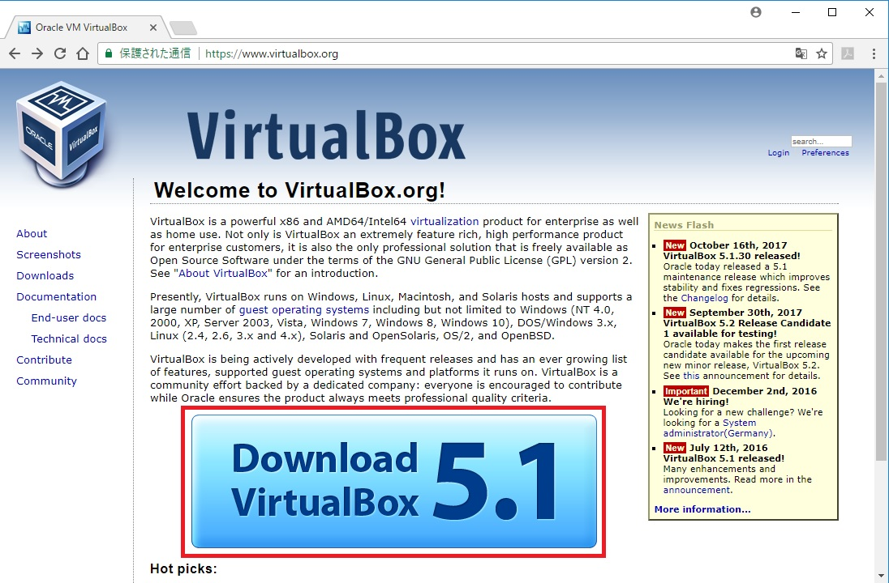

# VirtualBoxをインストールする

1. VirtualBoxダウンロードサイトへアクセスする。https://www.virtualbox.org/  
  
2．VirtualBox 5.1.30 platform packagesにある該当OSをクリック。（インストーラがダウンロードされる）　　
今回はWindowsを選択する。  
  
3．ダウンロードされたインストーラを実行すると次のように表示されるので、「next」を選択する。  

  

5．VirtualBoxをインストールする場所の指定ができる。  
今回は特に変更する必要がないので「next」を選択。

  

  
6．インストール後のショートカットやアイコンの設定。  
こちらも同じく変更する必要がないので「next」を選択。  

  

  
7．一時的にネットワークが切断されるという警告がでるがそのままYesを選択。    
(インストール後復帰するので、心配しなくても良い。)

  

  
8．インストールの最終確認画面が表示されるので「install」を選択。  

  

  
9．インストール完了後「Finish」をクリックするとインストーラが終了し、VirtualBoxが起動する。  

  

  
